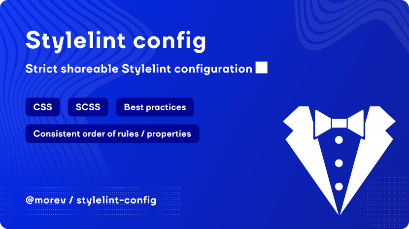

[](https://opensource.org/licenses/MIT)


# @morev/stylelint-config

Strict shareable Stylelint configuration with reasonable defaults.

✔️ 200+ configured rules of Stylelint and its plugins; \
✔️ 70+ extra rules for SCSS; \
✔️ Consistent order of properties and rules according to BEM methodology.

---

## Installation

### Using `yarn`

```bash
yarn add stylelint @morev/stylelint-config --dev
```

### Using `npm`

```bash
npm install -D stylelint @morev/stylelint-config
```

### Using `pnpm`

```bash
pnpm add -d stylelint @morev/stylelint-config
```

## Usage

Create a [Stylelint configuration file](https://stylelint.io/user-guide/configure/)
(`.stylelintrc.js` for the following instruction) in the package root with the following content:

> Note: the following instruction assumes that the package is written in ESM.
>
> For projects written in CommonJS (that doesn't have `"type": "module"` within its `package.json`)
> you need to specify `.cjs` extension for configuration file and use `module.exports` instead of `export default`.
>
> Alternatively you can use a configuration file defined in YAML or JSON format, but it's less extensible.

### SCSS repository (default)

```js
/** @type {import('stylelint').Config} */
export default {
  extends: [
    '@morev/stylelint-config',
  ],
  rules: {},
}
```

### CSS repository

```js
/** @type {import('stylelint').Config} */
export default {
  extends: [
    '@morev/stylelint-config/css',
  ],
  rules: {},
}
```

### Mixed (for some reason O_o) repository

```js
/** @type {import('stylelint').Config} */
export default {
  overrides: [
    { files: ['*.css'], extends: ['@morev/stylelint-config/css'] }
    { files: ['*.scss'], extends: ['@morev/stylelint-config/scss'] }
  ]
}
```
