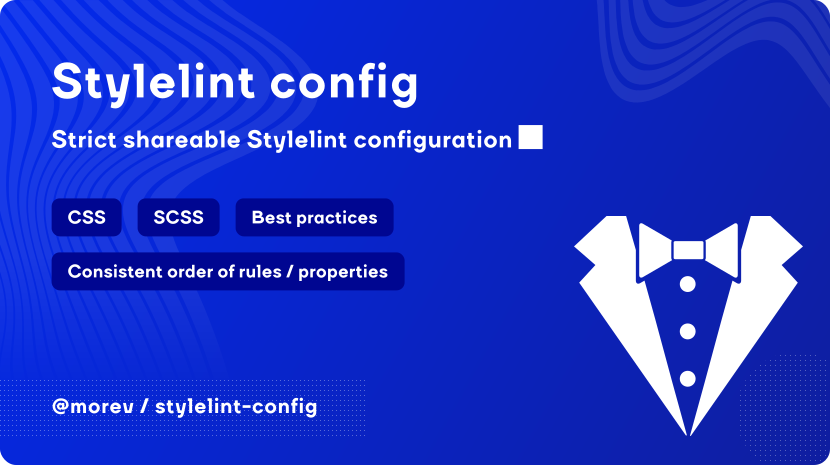

[](https://opensource.org/licenses/MIT)


# @morev/stylelint-config

Strict shareable Stylelint configuration with reasonable defaults.

✔️ 200+ configured rules of Stylelint and its plugins; \
✔️ 70+ extra rules for SCSS; \
✔️ Consistent order of properties and rules according to BEM methodology.

---

## Installation

### Using `yarn`

```sh
yarn add stylelint @morev/stylelint-config --dev
```

### Using `npm`

```sh
npm install -D stylelint @morev/stylelint-config
```

### Using `pnpm`

```sh
pnpm add -d stylelint @morev/stylelint-config
```

## Usage

Create a [Stylelint configuration file](https://stylelint.io/user-guide/configure/)
(`stylelint.config.ts` for the following instruction) in the package root with the following content:

### SCSS repository (default)

```js
import { defineConfig } from '@morev/stylelint-config';

export default defineConfig();
```

SCSS preset is used by default. You can also choose it explicitly:

```js
import { defineConfig } from '@morev/stylelint-config';

export default defineConfig({ preset: 'scss' });
```

### CSS repository

```js
import { defineConfig } from '@morev/stylelint-config';

export default defineConfig({ preset: 'css' });
```

### Mixed repository

```js
import { defineConfig } from '@morev/stylelint-config';

export default defineConfig({
  targets: [
    { files: ['*.css'], preset: 'css' },
    { files: ['*.scss'], preset: 'scss' },
  ],
});
```

> [!NOTE]
> The root `preset` option is for single-preset projects. \
> Mixed repositories should
> use `targets`; `preset` and `targets` are mutually exclusive at the root level.

### Custom order

`defineConfig` accepts project-specific rules order overrides without redefining the whole
[`order/order`](https://github.com/hudochenkov/stylelint-order/blob/master/rules/order/README.md)
value.

The `order` option intentionally supports only configurable project
groups:

- `mixins`
- `blockMixins`
- `mediaQueries`
- `containerQueries`.

Use it when a project has its own mixins, custom media, or container query conventions
that should be sorted near the built-in groups while the rest of the package order
stays managed by this config.

```js
import { defineConfig } from '@morev/stylelint-config';

export default defineConfig({
  preset: 'scss',
  order: {
    // Arrays replace the default values for the group.
    mixins: ['theme-dark'],
    blockMixins: ['responsive'],
    // The callback return value also replaces defaults; spread them to extend instead.
    mediaQueries: (mediaQueries) => [
      '--watch',
      ...mediaQueries,
      '--ultra-wide',
    ],
    containerQueries: [],
  },
}, {
  // Rest elements can extend the config in Stylelint format.
  rules: {
    'selector-max-id': null,
  },
});
```

### Exported order values

The raw default order values are also exported for advanced Stylelint configuration:

```js
import {
  PROPERTIES_ORDER,
  RULES_ORDER,
  defineConfig,
} from '@morev/stylelint-config';

export default defineConfig({}, {
  rules: {
    'order/order': [RULES_ORDER, { severity: 'warning' }],
    'order/properties-order': [PROPERTIES_ORDER, { severity: 'warning' }],
  },
});
```

### BEM component files

Use `bem` as a scoped wrapper around
[`@morev/stylelint-plugin`](https://morevm.github.io/stylelint-plugin/) for BEM component files,
which usually make up only part of a repository.

> [!NOTE]
> In mixed CSS/SCSS repositories, the same `bem` option can be configured inside a specific target.

```js
import { defineConfig } from '@morev/stylelint-config';

export default defineConfig({
  preset: 'scss',
  bem: {
    files: [
      './src/components/**/*.{css,scss}',
      './src/blocks/**/*.{css,scss}',
    ],
    separators: {
      element: '__',
      modifier: '--',
      modifierValue: '--',
    },
    rules: {
      // Extends the default rule: keeps built-in presets and adds a project exception.
      '@morev/bem/no-block-properties': (rule) => rule.merge({
        allowProperties: ['position'],
      }),

      // Replaces the default rule: the value below is used as-is.
      '@morev/bem/no-side-effects': [true, {
        ignore: ['.swiper-*'],
      }],
    },
  },
});
```
